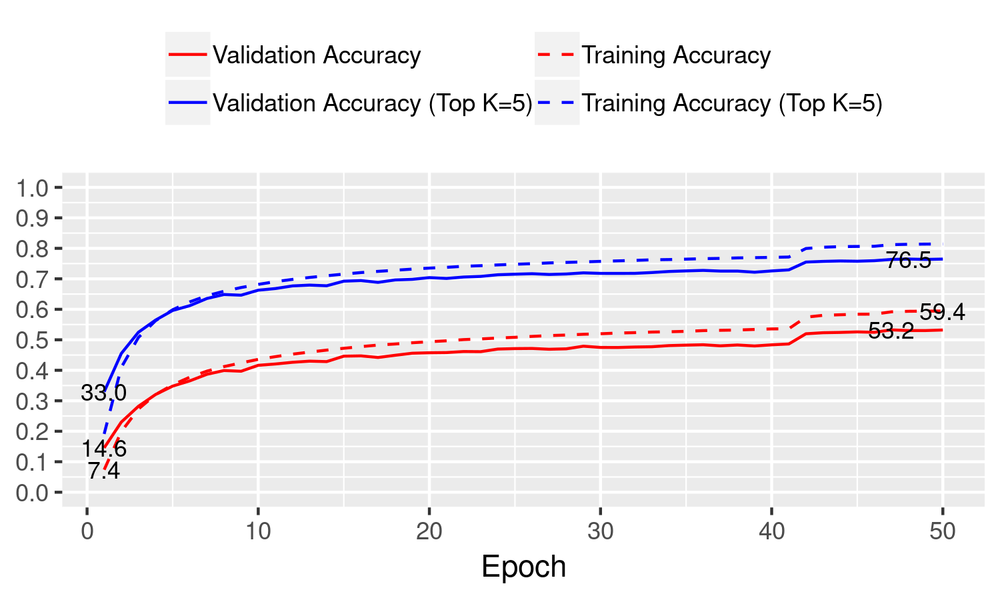

```
    --augmentation-level 3 \
    --batch-size 128 \
    --bits 1 \
    --bits-a 1 \
    --dataset imagenet \
    --epochs 50 \
    --gpus 2,3 \
    --initialization gaussian \
    --lr 0.001 \
    --lr-factor 0.1 \
    --lr-steps 40,45 \
    --model resnet18_v2-scaled \
    --optimizer adam \
    --wd 0.0 \
```


[post_process.csv](post_process.csv)
[plot.gv.pdf](plot.gv.pdf)