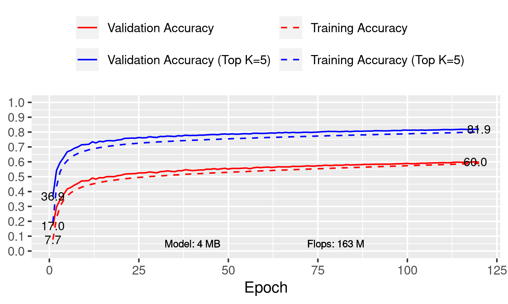

```
python image_classification.py \
    --data-dir ~/.mxnet/datasets/imagenet/ \
    --batch-size 128 \
    --clip-threshold 1.3 \
    --dataset imagenet \
    --epochs 120 \
    --fp-downsample-sc \
    --gpus 0,1 \
    --lr 0.002 \
    --lr-mode cosine \
    --mode hybrid \
    --model resnet18_e1 \
    --optimizer radam \
    --pool-downsample-sc \
```


## Files

- [post_process.csv](post_process.csv)
- [plot.gv.pdf](plot.gv.pdf)

