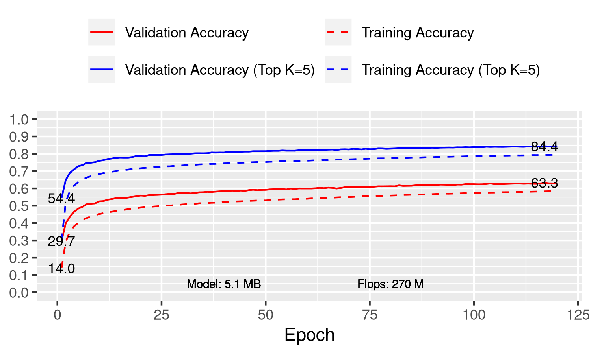

```
python image_classification.py \
    --data-dir ~/.mxnet/datasets/imagenet/ \
    --augmentation medium \
    --batch-size 16 \
    --block-config 6,8,12,6 \
    --clip-threshold 1.3 \
    --dataset imagenet \
    --epochs 120 \
    --gpus 0,1 \
    --growth-rate 64 \
    --init-features 64 \
    --lr 0.002 \
    --lr-mode cosine \
    --mode hybrid \
    --model densenet_flex \
    --optimizer radam \
    --reduction 3.3,3.3,4 \
```


## Files

- [post_process.csv](post_process.csv)
- [plot.gv.pdf](plot.gv.pdf)

