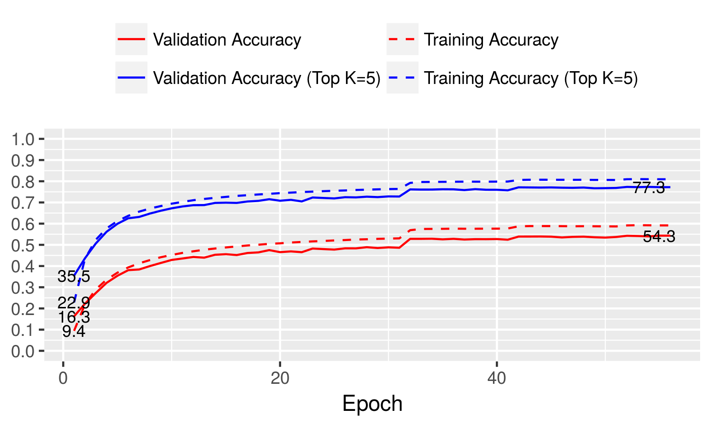

```
    --augmentation-level 3 \
    --batch-size 64 \
    --bits 1 \
    --bits-a 1 \
    --dataset imagenet \
    --epochs 60 \
    --gpus 0,1 \
    --reduction 1,1.4,1.4 \
    --growth-rate 64 \
    --init-features 64 \
    --initialization gaussian \
    --lr 0.001 \
    --lr-steps 30,40,50 \
    --model densenet37 \
    --optimizer adam \
    --wd 0.0 \
```

[post_process.csv](post_process.csv)
