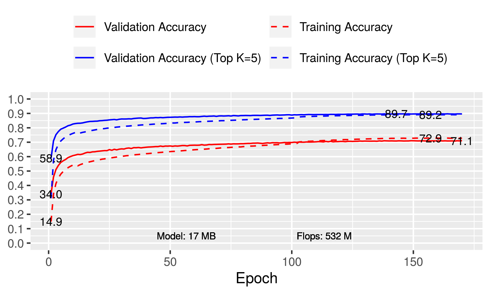

```
python image_classification.py \
    --data-dir ~/.mxnet/datasets/imagenet/ \
    --block-config 6,12,24,12 \
    --augmentation medium \
    --clip-threshold 1.3 \
    --dataset imagenet \
    --epochs 120  \
    --gpus 0,1,2,3,4,5,6,7 \
    --growth-rate 64 \
    --init-features 64 \
    --initial-layers  grouped_stem  \
    --lr 0.003 \
    --lr-mode cosine \
    --mode hybrid \
    --model meliusnet_flex \
    --optimizer adam  \
    --reduction 2.5,3,3.5 \
```


## Files

- [post_process.csv](post_process.csv)
- [plot.gv.pdf](plot.gv.pdf)

