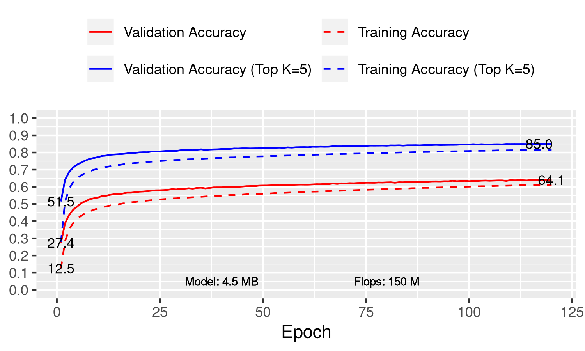

```
python image_classification.py \
    --data-dir ~/.mxnet/datasets/imagenet/ \
    --batch-size 32 \
    --block-config 3,5,10,6 \
    --clip-threshold 1.3 \
    --dataset imagenet \
    --downsample-structure norm,max_pool,relu,cs,fp_conv:4 \
    --epochs 120 \
    --gpus 0,1,2,3 \
    --initial-layers grouped_stem \
    --lr 0.002 \
    --lr-mode cosine \
    --mode hybrid \
    --model meliusnet_flex \
    --optimizer radam \
    --reduction 2,2.4,3 \
```


## Files

- [post_process.csv](post_process.csv)
- [plot.gv.pdf](plot.gv.pdf)

