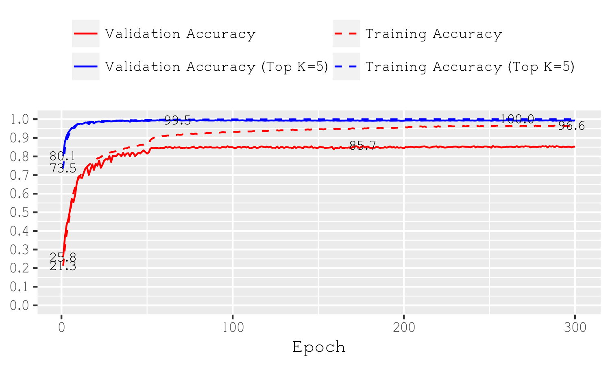
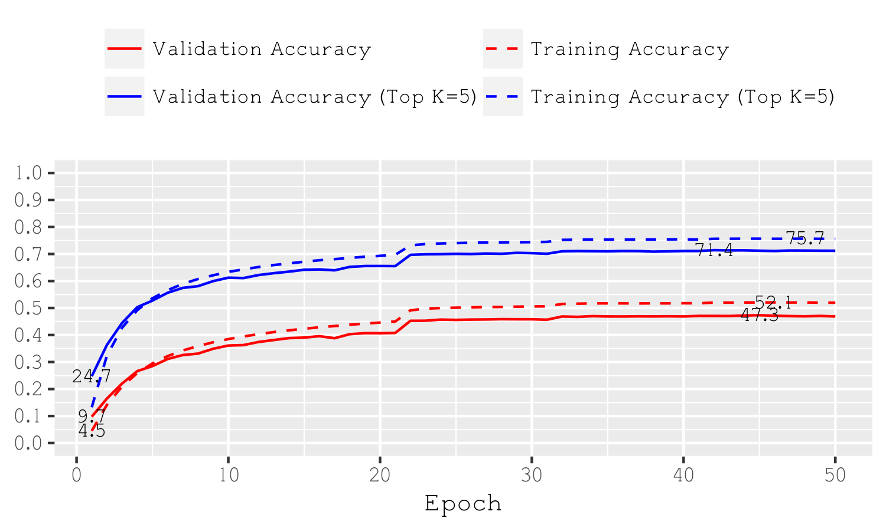

Some arguments explained:
- `--data-path` should point to a directory where cifar10 is downloaded to (the first time), and later loaded from. If you get a corrupt ZIP-File Error you might have cancelled a previous download, simply delete the ZIP and restart. (only needed for CIFAR)
- `--data-dir` should point to a directory with ImageNet record files, i.e. `imagenet-val.rec` and `imagenet-train.rec` (only needed for ImageNet); use the [official guide](https://mxnet.incubator.apache.org/tutorials/vision/large_scale_classification.html) or the guide from [Gluon-CV](https://gluon-cv.mxnet.io/build/examples_datasets/recordio.html#imagerecord-file-for-imagenet) to create these files
- `--resume` and `--start-epoch` are to continue training from a previous checkpoint, i.e. `--resume checkpoint_epoch_10.params --start-epoch 10` lets you restart training at epoch 10 from that checkpoint. Note that both arguments are independent, and epoch must be set correctly manually.

This should train a binary model with >85% Accuracy on CIFAR10:
```
python image_classification.py \
    --data-path "/path/to/cifar/" \
    --batch-size 256 \
    --bits 1 \
    --bits-a 1 \
    --dataset cifar10 \
    --epochs 300 \
    --gpus 0 \
    --initialization gaussian \
    --lr 0.01 \
    --lr-steps 50,200,250 \
    --model resnet18_v1 \
    --optimizer adam \
    --prefix model \
    --wd 0.0
```


This should train a binary model with ~47% Accuracy on ImageNet:
```
python image_classification.py \
    --data-dir "/path/to/imagenet/" \
    --batch-size 128 \
    --bits 1 \
    --bits-a 1 \
    --dataset imagenet \
    --epochs 50 \
    --gpus 0,1 \
    --initialization gaussian \
    --log-interval 20 \
    --lr 0.001 \
    --lr-steps 20,30,40 \
    --model resnet18_v1 \
    --optimizer adam \
    --prefix model \
    --wd 0.0
```


Please check our extensive [experiments](Binary-Network-Results.md) page for better results and other network architectures.
